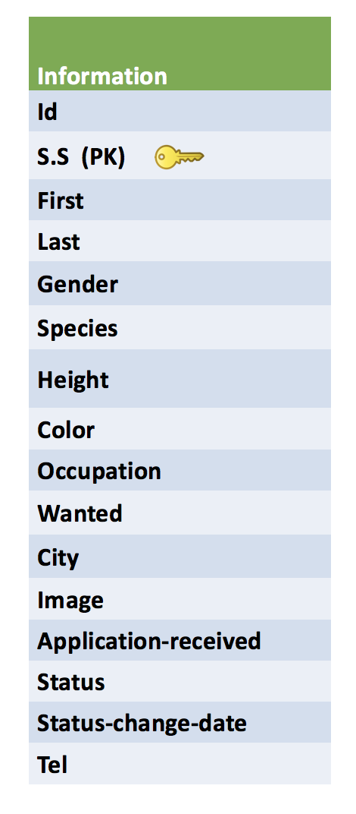

<a name="goback">

# Zootopia Embassy APP
## Live:[Zootopia embassy APP](https://embassy-of-zootopia.herokuapp.com/)

</a> 

### Esraa Alaarag 

## Table of Contents

1. [App description](#appdescription)
2. [User Stories](#userstories)
3. [Wireframes](#wireframesweb)
4. [Visual representation of the database](#database)
5. [Pseudocode](#pseudocode)
8. [Technologies used](#technologies)
9. [Live deployment](#project)

<a name="appdescription">

## APP DESCRIPTION:

Zootopia is an application for Zootopia Embassy that helps people who apply to renew their passport to track their passport renewal process.

### This project consists of three parts:

1.Zootopia API: 

This app works as Restful API to store all Zootopia citizens information and provide the embassy with detailed information on every citizen.
This API provides.

*	Basic CRUD (Create, Read, Update and Delete) with postman.

*	Cross-origin Resource Sharing using by using CORS middleware.

#### Live demo: https://zootopia-api.herokuapp.com/

2.Embassy of Zootopia app:

This part is for the official use of the embassy staff. The embassy staff can import the applicant information from the government API and store it to the embassy database. they can add the date the application was received and update the status of the application and the date when the status was updated.

Also this part serve as API for Zootopia citizen APP.  Zootopia citizen AP make axios get Request to this API to get the status of the application.

#### Live demo: https://embassy-of-zootopia.herokuapp.com/

3.Zootopia citizen APP:

A customized HTML template for the citizen of Zootopia to check the status of their passport renewal application.

Applicants can enter their social security number to check the status of their passport.


#### Live demo: https://esraa-alaarag.github.io/zootopia/

</a>

<a name="userstories">

## USER STORIES:

* 	As an embassy staff, I want to be able to view all the citizens’ information.
*	As an embassy staff, I want to be able to search the government database by applicant’s social security number.
*	As an embassy staff, I want to see if the applicant is wanted or not.
*	As an embassy staff, I want to see a card with individual information about one applicant that contains his/her photo.
*	As an embassy staff, I want to import applicant’s information to the embassy local database by clicking on a button on the table.
*	As an embassy staff, I want to I want to be able to add the applicant to the embassy local database by clicking on a button on the card
*  As an embassy staff, I want to be able to add date of application received, status, date of status and add telephone number.
*	As an embassy staff, I want to delete the applicant from the local database.
*  As an embassy staff, I want to know if the applicant that I’m importing to the local database already exist.
*	As an embassy staff, I want to know if importing applicant’s information to the local database was done successfully.

<a name="wireframesweb"> 

## WIREFRAMES:

### Government database:

### Embassy database: 

</a>

<a name="pseudocode">

## PSEUDOCODE:

#### Gov page

*  Display all records from gov API on page load.*  Display any person’s information individually on click as a card (modal)
*  Inform the staff member if the applicant is wanted by the government.
*  Create add to database function this function can be called directly from the table or from the modal. 
*  Display alert if importing the information was successful 
*  Display alert if the person is already existed in the database.
*  Add search bar so the applicant can be searcher by Social Security number.

#### Embassy page

*  Display all the record existed in the local database.
*  Add Delete button so the applicant information can be deleted from the local database. 
*  Create modal for view applicant photo id
*  Edit the table information to add the passport status, the date passport was received and the change of the status.

#### USERDB page

*  Create limited API that returns the applicant name, social security number, date the application was received, passport status and date of last update.
</a>

<a name="database"> 

## ERD/VISUAL REPRESENTATION OF DATABASE:

## Embassy_db

</a>

<a name="technologies"> 

## TECHNOLOGIES USED:

### Core Stack:

- Node.js
- Express
- HTML
- CSS
- JavaScript
- jQuery
- Heroku
- Github

### Middleware:

- Axios
- bootstrap
- cors
- bluebird
- Postgresql
- pg-promise
- dotenv
- morgan
- nodeman

### Also

- Trello 
- Postman (API and DB testing)
- Postico

</a>

<a name="project">

## SEE THE PROJECT:

### Live Deployment of App: 

https://embassy-of-zootopia.herokuapp.com/

</a>

[Go Back to the Table of Content](#goback)
